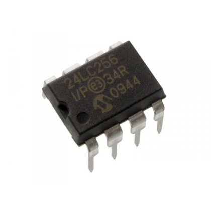

# EEPROM-24LC256-Library

This library provides full functionality of the 24LC256 EEPROM over SPI on an ATmega328P 8-bit AVR Microcontroller.

  

## Software

* Atmel Studio 6.0 - Integrated Development Platform for developing and debugging AVR microcontrollers.

## License

This project is licensed under the MIT License - see the [LICENSE.md](LICENSE.md) file for details.
